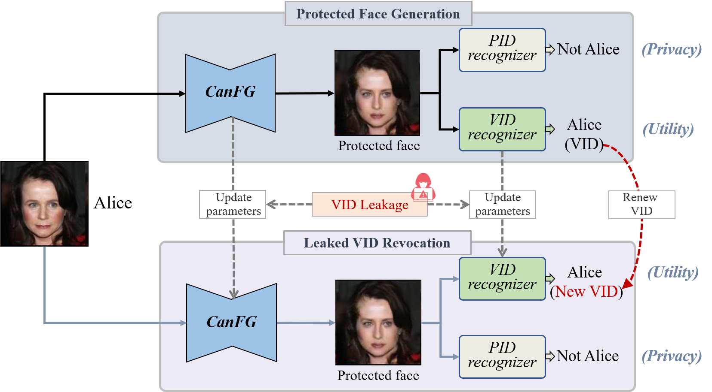

This repo is the official implementation of 
“Make Privacy Renewable! Generating Privacy-Preserving Faces Supporting Cancelable Biometric Recognition”  (2024 ACM MM)

Tao Wang, Yushu Zhang, Xiangli Xiao, Lin Yuan, Zhihua Xia, Jian Weng


Pretrained models and examples cropped data：https://drive.google.com/drive/folders/1HEWHaSyyNnX9owJWLB_mIAIIzHQ49Fka?usp=drive_link


## For input faces (whether training or test), the face alignment processing code must be employed to resize them to 128 pixels with "data_pre-processing"




## Just for testing
run generate_protected_paried_data.py

## Training a new model: (There may be code errors that have not yet been fixed.)

Step one: training the Auxiliary Physical Identity Remover

run training_for_Remover.py,   You can adjust the parameters lambda_rec and lambda_id


Step two: training  CanFG

run  training_for_CanFG.py,  You can adjust the parameters lambda_rec, lambda_em and lp, and modify the seed in CanFG.py "torch.manual_seed(85)" to obtain other random_orthogonal_matrix.


## License

更多的评估指标或数据可以参考 https://github.com/fkeufss/PRO-Face

```
@inproceedings{wang2024make,
  title={Make Privacy Renewable! Generating Privacy-Preserving Faces Supporting Cancelable Biometric Recognition},
  author={Wang, Tao and Zhang, Yushu and Xiao, Xiangli and Yuan, Lin and Xia, Zhihua and Weng, Jian},
  booktitle={Proc.  ACM Int. Conf. Multimedia},
  pages={10268--10276},
  year={2024},
  doi={10.1145/3664647.3680704}
}
```
